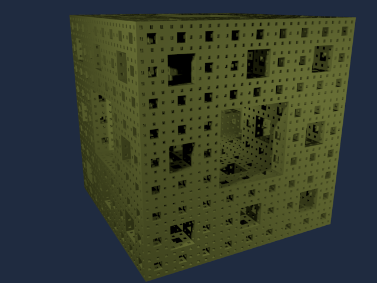

# Fractal
###### Generate any fractal that can be described by a [Lindenmayer system](https://en.wikipedia.org/wiki/L-system).

| Master | Develop |
| --- | --- |
|  |  |

</img>
</img>
## How to install and enable an add-on (v.2.78)

### Install add-on

- Download this as a zip file
- Go to `File > User Preferences... > Add-Ons`
- On the Bottom, click on `Install from File...`
- Select the zip file you want to install

### Enable an add-on

Just... Find the add-on in the `User Preferences` somehow, and tick the checkbox

### Draw a fractal

`Add` > `Mesh` > `Fractal` 
In the "New entity properties" - toolbox you first have to specify a [Lindenmayer system](https://en.wikipedia.org/wiki/L-system). A few examples are in this repository, in the directory `test_grammars`. 
Then, just iterate away. 
**Be careful though, these fractals can grow exponentially, iterate away in a _slow_ manner**

## A million thanks to the wonderful people of ANTLR

Who provided the parser generator I used, which made this project a thousand times easier. 
Their [project](http://www.antlr.org/).
